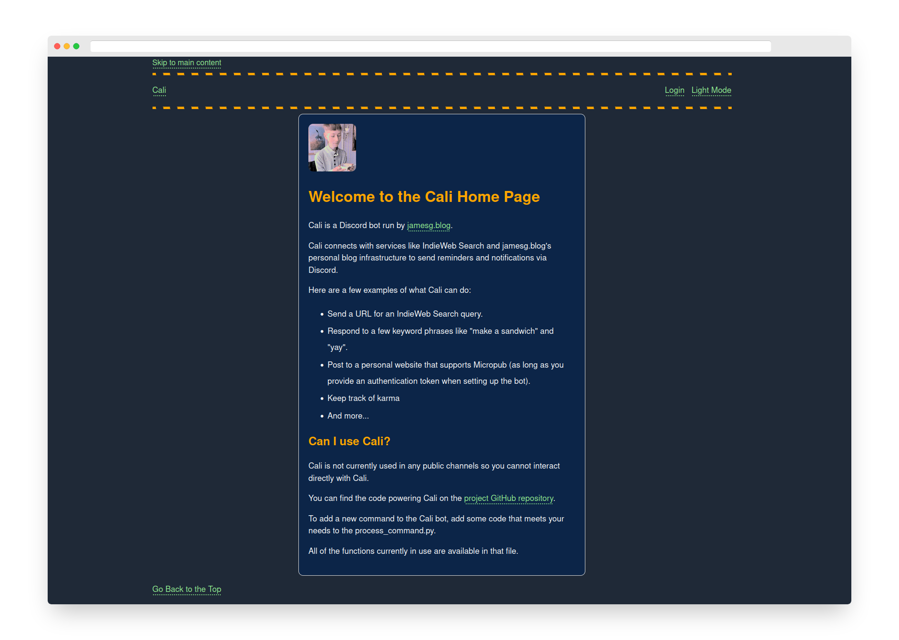

# Cali Discord Bot

This repository contains the code for Cali, my Discord bot.

Cali can, among other things:

- Make search requests to IndieWeb Search
- Keep track of karma (but only for a day)
- Engage in basic conversation
- Let me post content to my website
- Listen for requests to a HTTP server and relay the message via IRC

## Screenshot

## Getting Started

Cali has two components:

1. The Discord gateway server.
2. The webhook server.

You only need to run the gateway server in cali.py if you want to enable the conversational bot.

The webhook server lets you post a message as the bot on demand. For instance, you could send yourself a message when you get a [Webmention](https://indieweb.org/Webmention) from a website if your site is configured to receive webmentions.

Before you configure and start running Cali, you will need to install the required dependencies:

    pip3 install -r requirements.txt

You are now ready to start setting up Cali.

To set up Discord, first create a config.py file and enter values for these variables:

    DISCORD_BOT_TOKEN = "" # Your Discord bot token
    DISCORD_USERNAME = "" # Your personal Discord username
    API_KEY = "" # The API key you want to use to access the web API associated with this project
    DISCORD_POST_WEBHOOK = "" # A Discord Webhook URL that will let you post content to a channel

    MICROPUB_URL = "" # Your Micropub server API
    ACCESS_TOKEN = "" # Your Micropub access token

The first four variables are required to connect to Discord and to give Cali the ability to send messages to your channel.

Set values for the last two variables if you want to enable posting to your website using Micropub. You can leave these values blank if you do not want to enable posting via Micropub or if your site does not support Micropub.

After setting up the config.py file, you are ready to run the bot. You can do so using these commands:

    export FLASK_APP=cali.py
    flask run

## Web Socket Exploration

Cali has the capacity to interact over a web socket. An example websocket server is provided in the `websocket.py` file. Please note the websocket server uses ws:// rather than wss:// so the server is not recommended for use outside of testing environments. This feature was built to explore a web page where one could interact with Cali (see the `templates/chat.html` file for how the chat interface was coded).

There is no official support for interacting with the Cali bot using web sockets.

## Dependencies

This project relies on the following libraries:

- BeautifulSoup
- Flask
- requests
- discord.py

Please note that discord.py is no longer maintained by its author. This project functions according to my needs at the moment but may become unstable in the future if the discord.py library is not updated.

## License

This project is licensed under the MIT 0 license.

## Maintainers

- capjamesg
